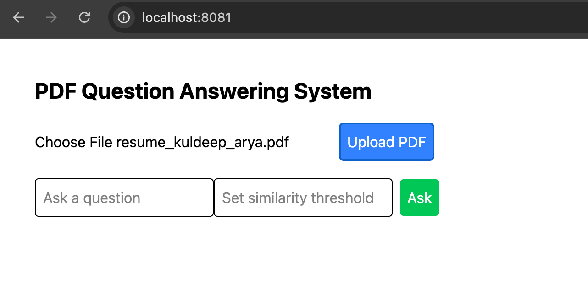
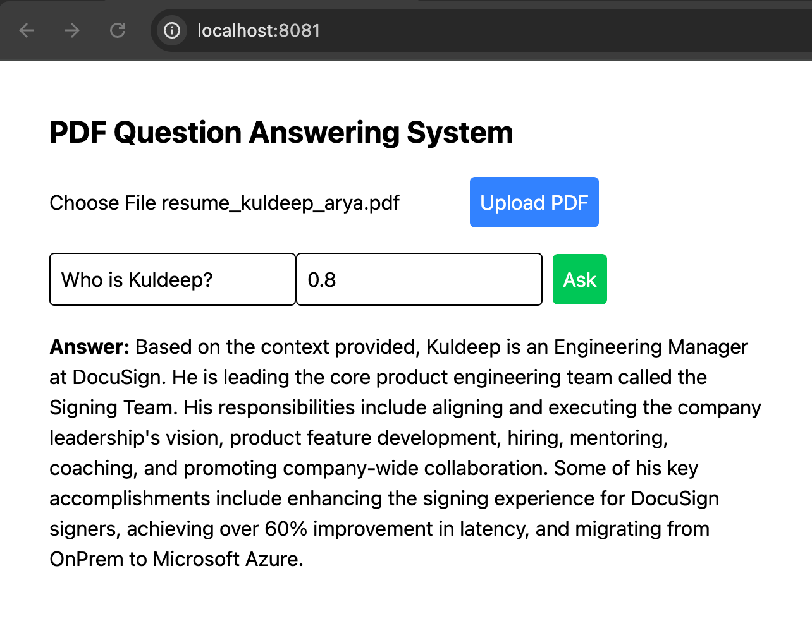

# What is this git repository all about?
This git repo is just to demonstrate one of the ways - known as RAG (Retrieval Augmented Generation) - to build an AI assisted question and answer system. Here is the implemented functionality -
1. System allows user to upload a pdf file.
2. Once file is uploaded successfully, user can ask questions and system tries to answer it only based on that uploaded document.
3. System also allows you to tune threshold - that will help controlling degree of similarity matching. (i.e. 1 very high similarity desired and 0 very strict similarity desired)
`Spoiler Alert - Finding the right threshold for your system is the most challenging part of this system.`
4. Systems is expected to not respond to the questions that are not relevant to the uploaded document.

Please Note - It's a RAG (Retrieval Augmented Generation) prototype, you can build this use case by solely relying on the LLM such as based on Open AI LLM APIs. Check the other repo - [AI Assisted Q&A prototype](https://github.com/kuldeeparyadotcom/ai_assisted_qna_prototype) - that demonstrates how to achieve it in non-RAG way. In fact, in many cases that may produce way better results. Be mindful about pros and cons of both approaches.

# How to build and run this code

### Step 1 - Clone the repo. Enter your OpenAI API key in .env file.
1. Create a .env file in the root directory (if it doesn't exist already)
2. Insert/Append a line to .env file such as the following - 
`OPENAI_API_KEY="sk-proj-your-key-goes-here"`

### Step 2 - Run Docker Compose Up from the root directory where docker-compose.yml resides.
`docker compose -f 'docker-compose.yml' up -d --build`

### Step 3 - Access UI from browser.
`http://localhost:8081/`

1. #### Upload PDF
    Upload a PDF via UI - Click on Choose File button and select a PDF file.
    
2. #### Ask Question
    Ask question.
    

3. #### Provide similarity threshold
    0.0 for the most strict similarity and 1.0 for the least similarity desired. In my testing, somewhere around 0.8 and 0.6 works great.

### Got any question/feedback?
Feel free to reach out via [LinkedIn](https://www.linkedin.com/in/kuldeeparyadotcom/).
